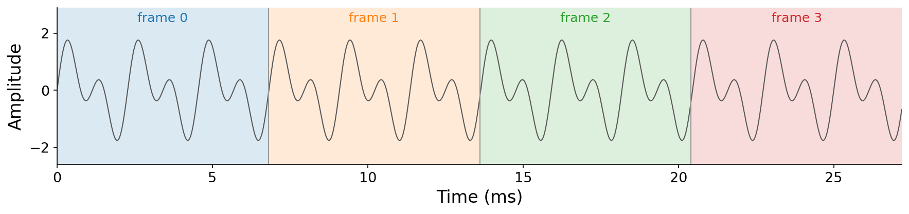

# 10.0 Extracting frames

We begin with the most basic operation: chopping a signal into frames.

:::{prf:definition} Frame extraction
:label: def-frame
To extract frames of {vocab}`frame length` $N_F$ from a signal $x$, the $n$-th sample of the $k$-th frame $x_k$ is

$$x_k[n] = \begin{cases} x[k \cdot N_H + n] & \text{for } n \in \{0, 1, \ldots, N_F - 1\}, \\ 0 & \text{otherwise,}\end{cases}$$

where $N_H$ is the {vocab}`hop length`, the spacing in samples between the start of one frame and the start of the next.
:::

That is all there is to it: we extract segments of $N_F$ samples along the signal in increments of $N_H$ samples, and each stop is a frame. The simplest case takes $N_H = N_F$, so the frames tile the signal end to end:

:::{figure}

Extracting frames with $N_H = N_F$: the frames tile the signal one after another with no overlap.
:::

If the signal is sampled at $f_s$, this produces frames at a {vocab}`frame rate` of

$$f_k \left[{unit}`frames,second`\right] = f_s \left[{unit}`samples,second`\right] \cdot \frac{1}{N_H} \left[{unit}`frames,sample`\right].$$

Frames give us a new unit of time, complementing the _seconds_ and _samples_ we already know. The offset of frame $k$ is $k \cdot N_H$ samples, so its natural timestamp $t_k$ is $\frac{k \cdot N_H}{f_s}$ seconds. For example, at $f_s = 44{,}100$ Hz with $N_H = 1024$, frame $10$ represents the moment $t_{10} = \frac{10 \cdot 1024}{44100} \approx 232$ ms. Conversely, a recording of duration $T$ spans $\frac{T \cdot f_s}{N_H}$ frames, so a ten-second file at these settings is about $\frac{10 \cdot 44100}{1024} \approx 430.7$ frames. (We will deal with that fractional frame shortly.)

The relationship between $N_F$ and $N_H$ controls how much consecutive frames _overlap_. When $N_H < N_F$, each frame shares some samples with its neighbors. We quantify this as the {vocab}`overlap`, expressed as a fraction of the frame length:

$$\text{overlap} = \frac{N_F - N_H}{N_F}.$$

At $N_H = N_F$ there is no overlap (0%); at $N_H = N_F/2$ the frames overlap by half (50%). The animation below shows a single frame advancing across a signal at three overlap settings:

:::{figure}

The same frame length $N_F$ at three overlaps. Lowering the hop $N_H$ increases the overlap, packing the frames more densely (thin gray lines mark each frame offset $t_k$).
:::
