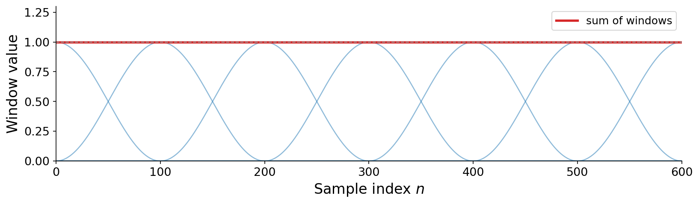

# 10.2 Windowing

In the previous section, we saw that overlapping frames can affect amplitude. The predictability of this suggests a potential mechanism to counteract it. Let's work our way towards a solution.

Instead of extracting raw frames, we can multiply each frame by a {vocab}`window` function $w \in \mathbb{R}^{N_F}$ as we extract it:

:::{prf:definition} Windowed frame extraction
:label: def-windowed-frame
Given a {vocab}`window` $w \in \mathbb{R}^{N_F}$, the windowed frame $x'_k$ is the extracted frame multiplied sample-by-sample by the window:

$$x'_k[n] = w[n] \cdot x[k \cdot N_H + n] = w[n] \cdot x_k[n].$$
:::

Overlap-add then reassembles the windowed frames, $\hat{x}[n] = \sum_k x'_k[n - k \cdot N_H]$. When does this still give perfect reconstruction? The condition is that the overlapping windows add up to the same non-zero constant at every sample:

:::{prf:definition} Constant overlap-add
:label: def-cola
A window $w$ and hop length $N_H$ satisfy the {vocab}`constant overlap-add` (COLA) property if the shifted windows sum to a non-zero constant $c$ at every sample $n$:

$$\sum_{k} w[n - k \cdot N_H] = c.$$

When they do, overlap-add reconstructs the original signal up to that constant factor, so dividing it out recovers $x$ exactly:

$$x[n] = \frac{1}{c}\, \hat{x}[n] = \frac{1}{c} \sum_{k} x'_k[n - k \cdot N_H].$$
:::

:::{note}
Strictly, COLA holds only if we imagine the windows continuing infinitely in both directions. At the very edges of a finite signal (near $0$ and $T$ seconds) fewer windows overlap, so their sum falls short of $c$. But as long as the sum is constant in the _steady state_ away from the edges, reconstruction is perfect there, and the affected fraction of the signal shrinks as the signal grows longer.
:::

Many combinations of window, frame length, and hop length satisfy COLA. The simplest is the rectangular window (all ones) at 0% overlap, which is exactly the perfect-reconstruction case we already saw ($c = 1$). A more useful one is the {vocab}`Hann window`,

$$w[n] = \frac{1}{2}\left(1 - \cos\!\left(\frac{2\pi n}{N_F}\right)\right),$$

a raised cosine bump that tapers smoothly to zero at both ends, used at 50% overlap (where the overlapping windows again sum to a constant):

:::{figure}

Hann windows at 50% overlap satisfy constant overlap-add: although each window rises and falls, the overlapping windows always sum to the same constant (bold line), so overlap-add reconstructs the signal exactly.
:::

Why would we ever prefer a tapered window to a plain rectangle, if both reconstruct perfectly? The reason has to do with what happens in the _frequency_ domain, and it will not become clear until we study the short-time Fourier transform later in this chapter. For now, take it on faith that smooth windows are often worth the trouble.

## Boundary conditions

In addition to the COLA edge cases, an eagle-eyed reader may have noticed we glossed over some other edge cases.

Firstly, what do we do with the _fractional frame_ at the end of a signal, where a frame starts inside the signal ($k \cdot N_H < N$) but runs off the end ($k \cdot N_H + N_F \geq N$)? Two conventions are common: we can {vocab}`zero-pad`, filling the missing tail of the frame with zeros, or we can simply truncate, discarding any frame that does not fit completely. Both are widely used.

Secondly, where should we anchor a frame relative to its timestamp? A frame canonically describes time at $t_k = k \cdot N_H$ samples. We have defined this sample as the _first_ of the corresponding frame, i.e., ${x_k[0] = k \cdot N_H}$. But it may be more intuitive in some cases to _center_ the frame around this timestep, i.e., ${x_k[\frac{N_F}{2}] = k \cdot N_H}$.

These two choices, alignment and padding, are independent, giving four combinations in all:

:::{figure}
![Four stacked panels of the same waveform, all with no overlap. Each shows frames as colored bands with a dashed line marking where the signal ends. Row 1 (left-aligned, zero-pad): frames start at the timestamp and the final frame extends past the signal end into a hatched zero-padded region. Row 2 (left-aligned, truncate): the final incomplete frame is dropped. Row 3 (centered, zero-pad): frames are centered on their timestamps, so the first frame extends before time zero into a hatched region. Row 4 (centered, truncate): incomplete frames at both ends are dropped.](./assets/fig-boundary.png)

The four boundary conventions: {left-aligned, centered} $\times$ {zero-pad, truncate}, shown with no overlap. Hatched regions are zero-padding beyond the signal; the dashed line marks the signal's end. You will encounter these in practice as arguments like `pad=True` or `center=False`.
:::

Ultimately these are just boundary conditions, affecting a smaller and smaller fraction of frames as the signal grows longer, so we will mostly ignore them from here on.
