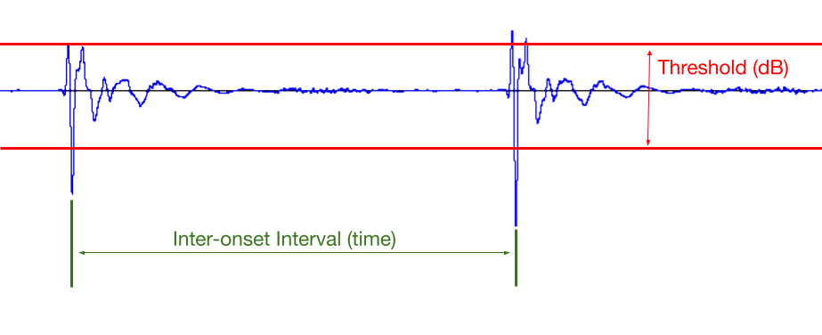

## Direction 3 (Technical): Implement tap detection to create scores

What if you could create the rhythm of a score just by tapping your finger? In this direction, you will implement a tap detection algorithm that detects spikes in an audio signal, then translates those spikes into rhythmical information for a score. These transient (tap) detection algorithms are also widely used in audio-reactive visuals and music information retrieval, os it's a useful algorithm to understand and tune to your use case.

Our version of tap detection will require you to create a pipeline from _audio file $\to$ score_, utilizing two main components : **loudness threshold** and **inter-onset interval (ioi)**. The figure below illustrates these two concepts. 

:::{figure}

:::

The threshold gives us a lower bound on how loud a sound must be for us to register it as an event. The IOI gives us the lower bound on how much time is between any number of events. In physical computing this is analogous to "debounce time" with buttons. Both of these parameters need to be _tuned_ so that we don't pick up events that are too soft, or too close to each other. For example, in the above example, if the minimum IOI is too small, we would actually pick up 4 events, since there are 4 peaks outside of the threshold.

### The Pipeline
1. Begin by recording 5 seconds of tapping with `pq.Record`
2. Save this recording as `tapping.wav`
3. Translate the rhythm of the tapping into a `pq.Score`
   1. You may choose how the pitches are determined. Popular examples in the past have been pre-defined looping melodies, randomness, and scales/arpeggios
   2. You must use the loudness threshold and inter-onset interval (ioi) to determine the rhythm of the score. We will ask you to provide us with their values in the writeup. You may additionally use other parameters if you come up with something helpful. 
4. Render the score with a sine wave instrument (see `pq.Score.render`)
5. Save the rendered audio as `song.wav`
### Requirements
- Implement the above pipeline in a file called `tap_detection.py`
- Submit `tap_detection.py`, `tapping.wav`, `tapping.wav` and `song.wav`
- In `TECHNICAL.md`, include:
  - The exact values of the loudness threshold and inter-onset interval, their units, and how you determined them
  - A description of how you determined the pitches for your score
