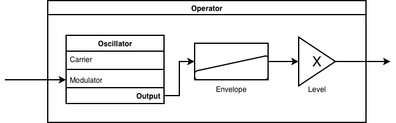
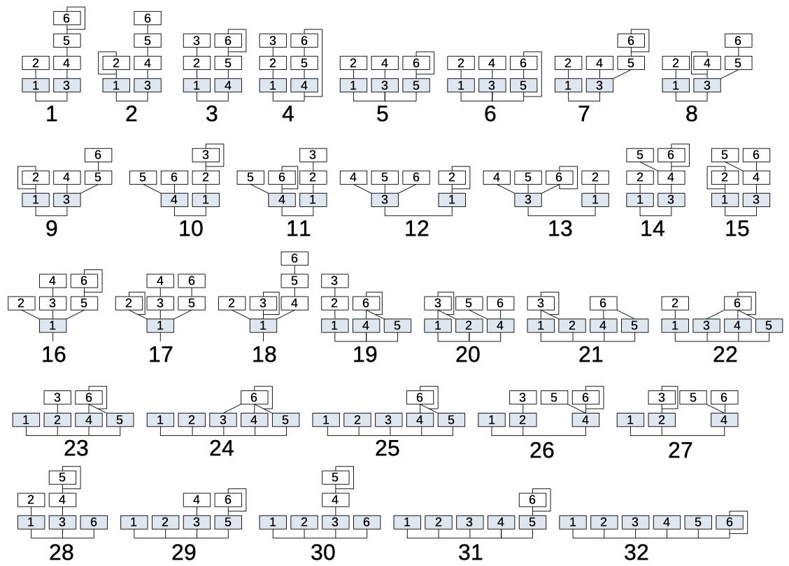

# Direction 2 (Technical): A DX-7 Instrument

The DX-7 is a famous FM synthesizer made by Yamaha from the 1980s. It includes 32 preset algorithms that define how 6 FM operators are connected. Even with only a few routing patterns, these algorithms can produce a wide range of timbres by changing the frequency ratios, modulation depths, and envelopes of the individual operators. 

**Requirements**
- Implement **two** any of the 32 algorithms **EXCEPT** _Algorithms 24, 25, 29, 30, 31, 32_,  faithfully to the spec (explained below)
- Create two meaningfully different sounds by changing the input parameters
- Ultimately wrap your implementation in a function `dx7_instrument(frequency, duration)` that returns a `pq.Audio` object
- In `TECHNICAL.md`, include
  - Tell us which 2 algorithms you implemented
  - Explain how you chose the parameters for your operators to create your two different sounds

**You May Use**
- AI to aid implementation (no AI-generated _sounds_)
- Online resources about DX-7 algorithms for reference (please list them in your writeup)

## DX-7 Algorithm

This algorithm is made up of 6 **operators**. Each operator must be provided with a carrier frequency, envelope, output level, and optionally, a modulation signal. Very simply, this is what an operator looks like :

Below are the 32 different operator topologies. For clarity, and adjoining lines means signal addition, and incoming lines to an operator are chaining (akin to Assignment 4 task 3).

For example, let's look at Algorithm 8. Each box represents an operator (oscillator). Operators 1 and 3 (in blue), are combined to form the output. The remaining operators provide modulation, as indicated by the lines. Operator 2 modulates operator 1. Operators 4 and 5 are combined to modulate operator 3, providing a complex modulation. Operator 6, in turn, modulates operator 5. Finally, the line looping around operator 4 indicates that operator 4 modulates itself. Since each modulation level can vary over time, the resulting sound can be very complex.

Ultimately, we want to be able to call your instrument as follows :
:::{code}
note = dx7_instrument(frequency=440.0, duration=2.0)
pq.play(note)
:::

**Tips + Notes**
- Each instrument is effectively a different set of input parameters to the 6 operators.
- In each operator, the oscillator's carrier signal should be a sine wave. You have already implemented this FM oscillator in Assignment 4, so feel free to reuse that code. 
- Some algorithms have operators that modulate themselves. This requires a feedback loop, which is not the same as just chaining the output of an operator back into itself. See **Self-Modulation** below. 
- The instrument should play different notes -- consider how you compute the carrier frequencies to be flexible to changing pitches
- Don't underestimate the power of the envelope!
- Want to learn more? Check out [This Website](https://yamahablackboxes.com/articles/how-to-program-yamaha-dx7/) or [This one](https://www.tinyloops.com/doc/yamaha_dx7/algorithms.html)

**Self-Modulation**
What the DX7 actually does, is compute modulation with a 1 sample delay. Mathematically, $\phi_{n+1} = \phi_n + \dfrac{2 \pi f_c}{f_s} + I y[n]$, $y[n] = \sin(\phi_n)$, where $y[n]$ is the output of the oscillator at time $n$. This means that the output of the oscillator at time $n$ is used to modulate itself at time $n+1$. Use a forloop or `np.cumsum` to implement this.
