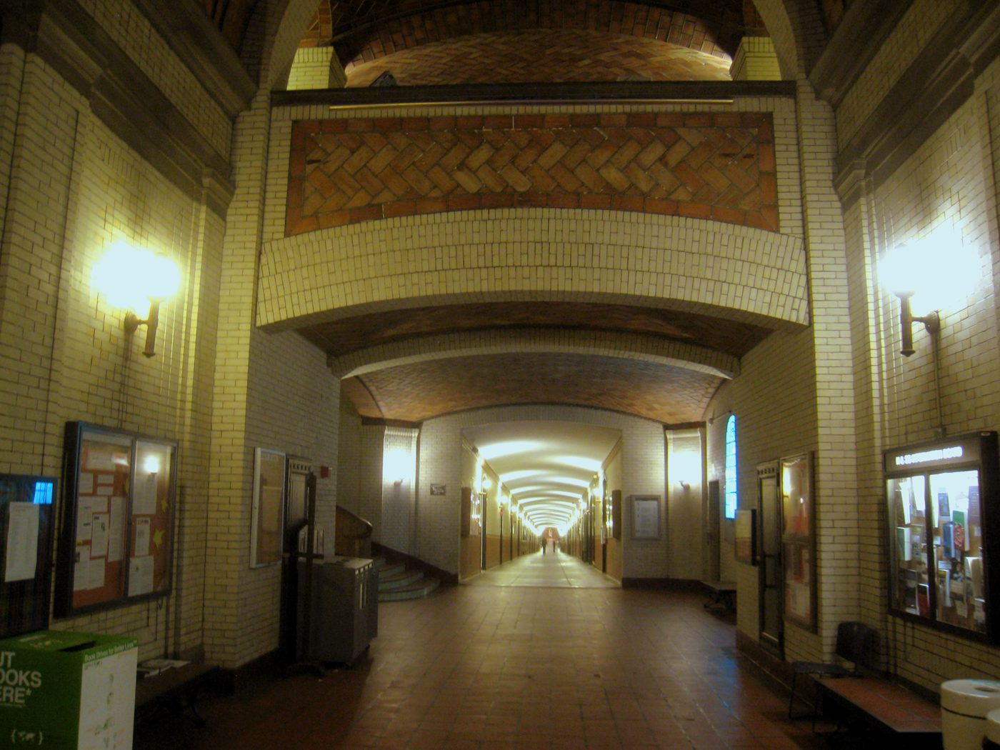

# Direction 1 (Creative): A Song from the Best Impulse Responses on Campus

In Assignment 6 you learned how convolution, the Fourier transform, and filters let you reshape sound. Convolution in particular gives us **convolution reverb**: if you capture the _impulse response_ (IR) of a real acoustic space, you can convolve any audio with that IR to make it sound as though it were played in that space. In this direction you will hunt for the best-sounding spaces on campus, capture their impulse responses yourself, and build a 30 to 60 second composition around them. The composition can take any form you like, from a short piece of music to a soundscape built from the sounds of the spaces themselves.

Campus is full of acoustically distinctive spaces: stairwells, tunnels, parking garages, practice rooms, the dome under Baker Hall. Each one colors sound differently, and no plugin preset sounds quite like the real thing.

:::{figure}

The vaulted hallway in Baker Hall, a good candidate for an impulse response. Photo by Daderot, public domain.
:::

**Capturing an IR.** There is no restriction on how you capture your impulse responses. The recommended method is a sharp, broadband impulse such as a hand clap or two small boards slapped together, recorded on whatever you have; even a phone works surprisingly well. You may instead use a sine sweep and deconvolve it into an IR, which yields a cleaner result, but a good sweep measurement takes serious hardware (a loud full-range speaker, a quality recorder, and a quiet space), so only go that route if you have access to the equipment. See the Assignment 6 notebook and [resources](../../resources/index.md) for guidance on turning a recording into a usable IR.

:::{important}
**Capture etiquette and safety.** Do not pop balloons: in an echoing indoor space a balloon pop sounds like a gunshot. Clap or slap two boards together instead; it is nearly as broadband. Capture when the space is empty (late evening or after hours), and tell anyone nearby before you make the noise.
:::

**Requirements**
- Capture **more than one** impulse response **yourself**, from different spaces on campus (found or downloaded IRs do not count toward this requirement)
- Use your captured IRs as **convolution reverb** on meaningful portions of your composition
- Use at least one **filter** (e.g., an EQ, low-pass, high-pass, or band-pass) to shape the spectrum of your sound
- 30 to 60 seconds in length
- In `CREATIVE.md`, include
  - A description of your song and the creative intent behind it
  - Where you captured each impulse response and why you chose those spaces
  - How you captured them (method, equipment, what you recorded)
  - A description of how you used convolution and filtering to achieve your desired sound

**You May Use**
- The TheoryTab or FreeSound API
- Any outside sources of audio (found or recorded)
  - Any outside audio material you use must be properly cited in your submission
- AI to aid implementation (no generating songs with Suno, Udio, etc.)
- Any DAW or editing software may be used to arrange and add effects, however a non-trivial amount of the track must be rendered by executing your submitted code
  - Acceptable: Use Pyquist to convolve your dry stems with your captured IRs and apply your own filters, then mix in a DAW
  - Unacceptable: Apply a stock convolution-reverb plugin in a DAW and compose the rest entirely outside of code

Need a good place to start?
- Build a soundscape from sounds of the spaces themselves (footsteps, doors, a distant vending machine), convolved back into the rooms they came from
- Scout several spaces (a stairwell, a tunnel, a big empty hall) and capture an IR in each, then audition them on the same dry sound and keep the winners
- Record several different excitations (clap, wood slap, sweep) in one space and compare how their IRs color your sound
- Contrast a dry, close sound against the same sound drenched in your most dramatic space
- Move a melody from one space to another as the piece unfolds
- Use a filter to carve space for the reverb tail so your mix doesn't get muddy
