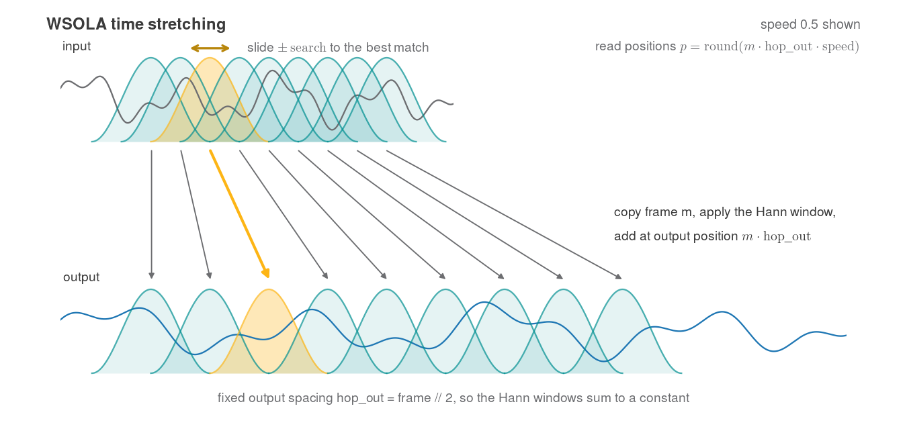

# Direction 2 (Technical): Bending Time

In 1958, Ross Bagdasarian sang into a tape recorder running at half speed, played the tape back at full speed, and sold millions of records as Alvin and the Chipmunks. That was the state of the art for changing the speed of audio: time and pitch came locked together, on every tape deck, turntable, and sampler. Slow a sound down and it drops an octave; speed it up and it squeaks.

Separating time from pitch takes real signal processing, and there are two classic ways to do it: re-space short overlapping windowed frames of the signal in the time domain (**WSOLA**), or analyze the sound into an STFT and play its frames back at a different hop while keeping every bin's phase continuous (the **phase vocoder**, Bell Labs 1966). In this direction you build one of them, your choice.

:::{figure}

The playback speed menu on Me at the zoo, the first video ever uploaded to YouTube. In Chrome, that slider runs WSOLA, a time-domain overlap-add in the same family as Route A below.
:::

**The goal.** Write a function that changes the playback speed of a recording while keeping its pitch unchanged: at `speed = 0.5` the sound takes twice as long without dropping an octave, and at `speed = 2.0` half as long without the squeak.

:::::{tab-set}

::::{tab-item} Route A: WSOLA (easier)
Overlap-add short Hann-windowed frames at a fixed output spacing while the read position steps through the input at the chosen speed, sliding each frame a few milliseconds to the best-matching splice point before you add it; each frame plays at its native rate, so pitch stays put. This is **WSOLA** (waveform similarity overlap-add), the algorithm Chrome runs behind the YouTube speed slider (its [implementation](https://chromium.googlesource.com/chromium/src/+/main/media/filters/audio_renderer_algorithm.cc) is public and readable), and Firefox ships the same family via SoundTouch. Each frame here plays the role of a grain in Assignment 7's granular synthesis, with the loop inverted: Assignment 7 kept the input hop fixed, WSOLA fixes the output spacing. Analyzing the artifacts that remain, mainly doubled transients, is part of the writeup.

:::{figure}

Route A at speed 0.5: the read position advances through the input at half rate, and each frame slides a few milliseconds to the best-matching splice point before overlap-adding at a fixed output spacing.
:::
::::

::::{tab-item} Route B: the phase vocoder (harder)
Analyze with the `stft` you wrote in Assignment 7 at a hop of `hop_out * speed`, then resynthesize the same frames with your `istft` at `hop_out`; frames map one to one, and correcting the phases for the new spacing is the entire difficulty, with the three formulas in the starter notebook. This is the family behind the high-quality stretch in serious music tools: Rubber Band (inside DAWs and DJ tools like Ardour and Mixxx) and `librosa.effects.time_stretch` are both phase vocoders.

:::{figure}

The phase vocoder route: analyze into overlapping windowed frames at `hop_in`, recover each bin's true phase advance, correct the phases for the new spacing, and resynthesize at `hop_out` by overlap-add.
:::
::::

:::::

:::{note}
**Choosing a route.** Both routes can earn full credit: Route A is a modest step beyond Assignment 7, Route B is harder and sounds cleaner on music. If you are unsure, take Route A; the vocoder makes a strong extension afterward.
:::

**{download}`Download the starter notebook <./assets/8-2-timescale.ipynb>`.** It provides the test signals, one function signature per route with the formulas each needs, and a verification cell that works with either route.

The notebook shows one good path through the topic, but this is an open-ended assignment: feel free to adjust it, restructure it, or leave it behind once you have ideas of your own. AI is allowed, and creativity is encouraged. **You do not submit the notebook.** Your deliverables are the standard open-ended technical format (demo video, `TECHNICAL.md`, and `src/`) described on the [Assignments page](../index.md#open-ended-submission-instructions-and-policies).

**Requirements**
- Implement **one** of the two routes yourself, as a single top-level function that takes a mono signal and a speed factor and returns the time-scaled signal (`wsola_time_scale` or `phase_vocoder` in the starter notebook); helper functions are welcome
- Duration must scale: at speeds 0.5 and 2.0, the output length must be within 10% of `len(x) / speed`
- Pitch must hold: a 220 Hz test tone must measure within 1% of 220 Hz at both speeds (the naive control is off by 50%, and Route A without the similarity search is off by 2%)
- Show the chirp spectrogram comparison from the verification cell: original, naive resampler, and your route
- If you take the phase vocoder route, build on your **own** Assignment 7 `stft` and `istft`; library STFTs defeat the point
- In `TECHNICAL.md`, include
  - An explanation of why naive resampling couples time and pitch, and how your route decouples them
  - The verification output and the chirp spectrograms
  - The artifacts you hear on real recordings (transient smearing or doubling, phasiness) and where in your algorithm they come from
  - A few sentences on why browsers ship WSOLA for playback speed while music tools ship phase vocoders, grounded in what you hear on speech versus music

**You May Use**
- AI to aid implementation
- Online resources about time-scale modification, the STFT, and the phase vocoder (please list them in your writeup); [Driedger and Müller's review](https://www.mdpi.com/2076-3417/6/2/57) covers both routes side by side and is a good starting point
- `numpy` only: no `scipy.signal`, `librosa`, or other ready-made DSP libraries (on the vocoder route, `np.fft.rfft` and `np.fft.irfft` are your only Fourier calls)

The recipes, the verification cell, and the listening tests are in the starter notebook.
