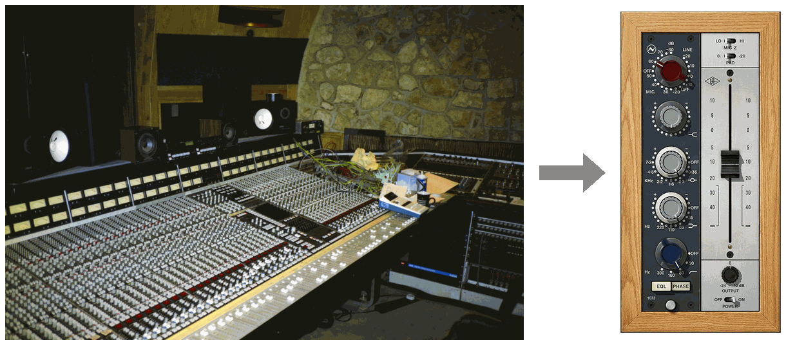

# Direction 2 (Technical): Analog Resurrection

Alexander "Howard" Dumble hand-built around three hundred amplifiers, voiced each one for its player (John Mayer tours with one), and potted his circuit boards in opaque epoxy so nobody could copy them. He died in 2022 without publishing a single schematic, and a community of engineers now painstakingly dissolves the "goop" on broken units to trace the circuits before the sound is lost forever. Meanwhile the most recorded EQ in history, the **Neve 1073** (1970), still sells for thousands of dollars per module, yet you can buy one as a plugin for a hundredth of the price. How?

:::{figure}

A Neve 80 series console at The Manor, Virgin's countryside studio, and the plugin recreation of its channel module, the 1073. Console photo by JacoTen, CC BY-SA 3.0. Plugin image from Universal Audio.
:::

The answer is a piece of math called the **bilinear transform**, which carries a system from continuous time into discrete time. An analog EQ is a real circuit: electricity flows smoothly through resistors and capacitors, and its voltage exists at every instant. That is _continuous time_, and a circuit living there is fully described by its **transfer function** `H(s)`, a formula you can work out from the circuit itself that says exactly how much it boosts or cuts each frequency. Your laptop never sees a smooth voltage. It sees 44,100 snapshots per second, a stream of plain numbers, which is _discrete time_. The bilinear transform converts `H(s)` into `H(z)`, a discrete-time system with the same response: a **digital EQ**, written as a _difference equation_, a short loop over the samples of a song that boosts and cuts exactly what the circuit did.

**Analog resurrection.** This is how companies like Universal Audio, Brainworx, and Neural DSP make their living: start from a revered circuit, work out its `H(s)`, and run it through the bilinear transform. In this direction you will build that pipeline yourself, an **analog-to-digital EQ compiler** that turns any cascade of analog filter sections into a running digital filter, and use it to resurrect a channel EQ modeled on the 1073.

**[Download the starter notebook](./assets/08-analog-resurrection/starter.zip)**. It contains the target EQ, step-by-step guidance with a checkpoint for every task, all the formulas you need, verification scaffolding, a numerical experiment where you get to watch a filter explode, and a listening test.

The notebook shows one good path through the topic, but this is an open-ended assignment: feel free to adjust it, restructure it, or leave it behind once you have ideas of your own. AI is allowed, and creativity is encouraged. **You do not submit the notebook.** Your deliverables are the standard open-ended technical format (demo video, `TECHNICAL.md`, and `src/`) described on the [Assignments page](../index.md#open-ended-submission-instructions-and-policies).

**Requirements**
- Implement the **normalized analog prototypes** (all formulas are given in the starter notebook): peaking, low-shelf, high-shelf, and Butterworth high-pass sections, including **third order** (the 1073's high-pass rolls off at 18 dB/octave; a biquads-only compiler can't build it)
- Write a `bilinear_transform` function that carries **one** analog section of **any order** into its digital `b` and `a` coefficients (the notebook walks you through the recipe)
  - You must **pre-warp** the section's critical frequency so the digital response matches the analog response exactly at that frequency
- Write a function that **combines the cascade of digital sections into one difference equation** (the full `b` and `a` of `H(z)`)
- Write your **own difference-equation engine** (`apply_filter`) that runs any `(b, a)` filter over a signal, verified against theory by measuring its impulse response
- Verify your compiler with a four-way frequency-response comparison and the coefficient-quantization experiment (the notebook provides scaffolding for both)
- In `TECHNICAL.md`, include
  - An explanation of what `bilinear_transform` does to a section, and why **pre-warping** is necessary
  - An explanation of how you combined the sections into one difference equation, and your findings from the quantization experiment: **why** every real-world EQ runs as a cascade of second-order sections even though the combined form is mathematically identical
  - The verification and experiment plots

**You May Use**
- AI to aid implementation
- Online resources about the bilinear transform, EQ design, and biquad filters (please list them in your writeup), but note the starter notebook's warning about the Audio EQ Cookbook's pre-baked digital coefficients
- `numpy` for numerical routines such as polynomial multiplication (`np.convolve`), but no `scipy.signal` or other ready-made filtering/DSP libraries

All formulas, hints, checkpoints, and the listening test are in the starter notebook.
