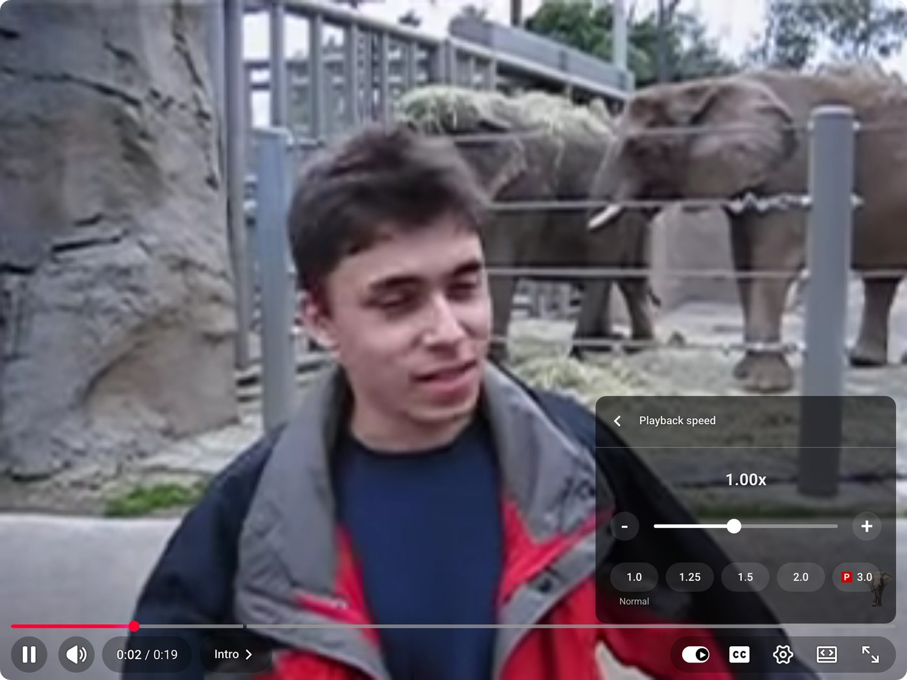

# Direction 3 (Technical): Bending Time

In 1958, Ross Bagdasarian sang into a tape recorder running at half speed, played the tape back at full speed, and sold millions of records as Alvin and the Chipmunks. That was the state of the art for changing the speed of audio: time and pitch came locked together, on every tape deck, turntable, and sampler. Slow a sound down and it drops an octave; speed it up and it squeaks.

The tool that finally separated them is the **phase vocoder**, invented at Bell Labs in 1966 by Flanagan and Golden. There is one behind your podcast app's speed slider, YouTube's playback menu, Ableton Live's warp engine, and half of the "slowed + reverb" remixes on the internet. In this direction you will build a small but real one: cut a sound into overlapping frames with an STFT (as in Assignment 7), keep the phase of every frequency bin _continuous_ while you re-space the frames in time, and splice the sound back together at a new speed, with the pitch unchanged.

:::{figure}

The playback speed menu on Me at the zoo, the first video ever uploaded to YouTube. A phase vocoder does the work behind that slider.
:::

**[Download the starter notebook](./assets/08-bending-time/starter.zip)**. It contains step-by-step guidance with a checkpoint for every task, all the formulas you need, verification scaffolding, and listening tests on both a synthetic tune and real audio.

The notebook shows one good path through the topic, but this is an open-ended assignment: feel free to adjust it, restructure it, or leave it behind once you have ideas of your own. AI is allowed, and creativity is encouraged. **You do not submit the notebook.** Your deliverables are the standard open-ended technical format (demo video, `TECHNICAL.md`, and `src/`) described on the [Assignments page](../index.md#open-ended-submission-instructions-and-policies).

**Requirements**
- Implement your own `stft` and `istft`: analysis into overlapping windowed frames, and resynthesis by **overlap-add** with proper window compensation, so that the round trip reconstructs the signal at **any** hop size (the notebook walks you through the recipe)
- Implement the phase bookkeeping: a phase-wrapping helper (`princarg`) and a function that recovers each bin's **true phase advance**, and therefore its true frequency, between consecutive frames
- Implement the phase vocoder itself (`pv_time_scale`): re-space the frames by the speed factor, **interpolate magnitudes** across frames, and let **phases accumulate** frame to frame via a running per-bin accumulator
- Verify your vocoder: the STFT→ISTFT round trip should be lossless, and pitch must hold at both 0.5x and 2.0x speed (the notebook provides checkpoints and the proof plots: a naive resampler as the control, plus spectrograms of a time-stretched chirp)
- In `TECHNICAL.md`, include
  - An explanation of why naive resampling couples time and pitch, and how the phase vocoder decouples them; in particular, why phases must be **accumulated** rather than interpolated like magnitudes
  - The verification and proof plots, and a note on the artifacts you hear at extreme stretch factors

**You May Use**
- AI to aid implementation
- Online resources about the STFT and the phase vocoder (please list them in your writeup)
- `numpy`, with `np.fft.rfft`/`np.fft.irfft` as your only Fourier calls; no `scipy.signal`, `librosa`, or other ready-made STFT/DSP libraries

All formulas, hints, checkpoints, and the listening tests are in the starter notebook.
